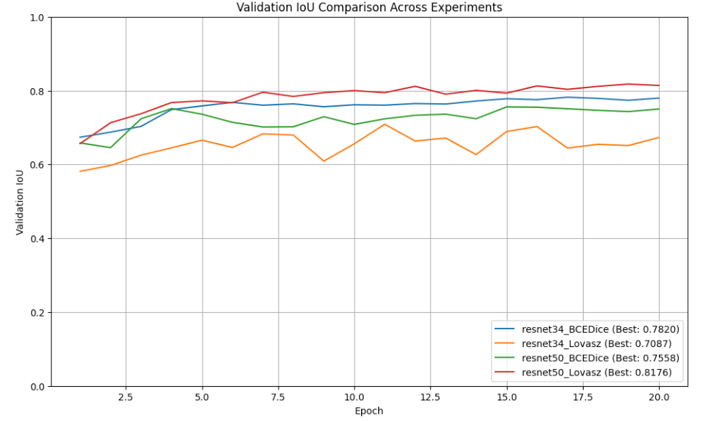

# TGS Salt Identification Challenge - Team 2 Notebook

## Overview

This Jupyter Notebook (`tgs-salt-challenge-be7910-team2.ipynb`) contains the code for tackling the Kaggle TGS Salt Identification Challenge. The goal is to build a machine learning model that accurately identifies salt deposits beneath the Earth's surface using seismic image data. This notebook implements an image segmentation pipeline using a U-Net architecture with ResNet backbones.

## Dependencies

The primary libraries used in this notebook are:

* **Python 3**
* **PyTorch:** For deep learning model building and training.
* **Torchvision:** For accessing pre-trained models (ResNet).
* **NumPy:** For numerical operations.
* **Pandas:** For data manipulation and handling CSV files.
* **OpenCV (cv2):** For image loading and basic processing.
* **Albumentations:** For data augmentation.
* **scikit-learn:** For train/validation splitting.
* **Matplotlib:** For plotting training curves.
* **tqdm:** For progress bars.
* **zipfile, os, shutil, time, random:** Standard Python libraries.

The code is designed to run in a Kaggle environment with GPU acceleration enabled.

## Data

* The notebook expects the competition data to be available in the `/kaggle/input/tgs-salt-identification-challenge/` directory.
* It automatically unzips `train.zip` and `test.zip` into `/kaggle/working/train` and `/kaggle/working/test` respectively if they don't already exist.
* **Training Data:** Consists of seismic images (`/kaggle/working/train/images`) and corresponding binary masks (`/kaggle/working/train/masks`) indicating salt presence (1) or absence (0).
* **Test Data:** Consists of seismic images (`/kaggle/working/test/images`) for which predictions need to be generated.

## Notebook Structure & Workflow

The notebook follows these main steps:

1.  **Setup:** Imports libraries and sets a random seed for reproducibility.
2.  **Augmentations:** Defines image augmentation pipelines for training and validation/testing using `albumentations`. Images are resized to 128x128 and normalized.
3.  **Model Definition:** Defines a U-Net architecture with a flexible ResNet (ResNet34 or ResNet50) encoder backbone.
4.  **Loss Functions:** Implements BCEDiceLoss and Lovasz Hinge Loss.
5.  **Data Loading & Splitting:** Loads image/mask file paths, performs an 80/20 train/validation split, and loads test image paths.
6.  **Dataset & DataLoaders:** Defines a custom `SaltDataset` class for PyTorch and creates `DataLoader` instances for training, validation, and testing.
7.  **Metrics & Training Loop:** Defines the Intersection over Union (IoU) metric calculation and a `train_validate_epoch` function to handle one epoch of training and validation, including progress bars.
8.  **Experimentation Loop:**
    * Defines four experimental configurations (ResNet34/50 backbone combined with BCEDice/Lovasz loss).
    * Iterates through each configuration:
        * Initializes the model, optimizer (Adam with weight decay), loss function, and learning rate scheduler (ReduceLROnPlateau based on validation IoU).
        * Trains the model for a set number of epochs (`NUM_EPOCHS`).
        * Tracks training/validation loss and IoU for each epoch.
        * Saves the model weights corresponding to the best validation IoU achieved *during that specific experiment run* to the `models/` directory.
        * Stores the training history and best validation metric for each configuration.
9.  **Comparison Plotting:** Generates and saves a plot comparing the validation IoU curves across all four experiments to the `results/` directory.
10. **Best Model Selection & Prediction:**
    * Identifies the overall best model configuration based on the highest validation IoU achieved across all experiments.
    * Loads the saved weights for this best model.
    * Performs predictions on the test dataset using the loaded best model. Predictions are resized back to the original 101x101 size.
11. **Submission File Generation:**
    * Encodes the binary test predictions into Run-Length Encoding (RLE) format.
    * Creates a `submission.csv` file in the format required by Kaggle.
12. **Output Zipping:** Zips the `models/` and `results/` folders for easy download from the Kaggle environment.

## Model Architecture

* **U-Net:** A standard encoder-decoder architecture for image segmentation.
* **Encoder:** Uses a pre-trained ResNet34 or ResNet50 model (from `torchvision`) as the backbone to extract features at different scales.
* **Decoder:** Uses `DecoderBlock` modules that combine upsampled feature maps from the previous decoder stage with skip connections from the corresponding encoder stage.
* **Output:** A final 1x1 convolution produces a single-channel output map (logits), which is then upsampled to the input image size. A sigmoid function is applied later (in loss calculation or prediction) to get probabilities.

## Training and Experiments

* **Optimizer:** Adam with weight decay (L2 regularization).
* **Learning Rate:** Initial learning rate is set, with a `ReduceLROnPlateau` scheduler adjusting it based on validation IoU.
* **Epochs:** Set to 20 for demonstration purposes (can be increased).
* **Batch Size:** Set to 32.
* **Experiments:** Four combinations are run:
    * ResNet34 + BCEDiceLoss
    * ResNet34 + LovaszLoss
    * ResNet50 + BCEDiceLoss
    * ResNet50 + LovaszLoss
* **Best Model Saving:** For each experiment, the model state achieving the highest validation IoU during that run is saved.

## Evaluation Metric

* **Intersection over Union (IoU):** The primary metric used for validation during training and for selecting the best model. It measures the overlap between the predicted mask and the ground truth mask. The `compute_iou` function calculates the mean IoU across a batch.

## Prediction and Submission

* The model configuration that achieved the highest validation IoU across all experiments is selected.
* Its saved weights are loaded.
* Predictions are made on the test set images.
* Output probabilities are thresholded (default 0.5) to create binary masks.
* Masks are resized to the original 101x101 dimensions.
* Binary masks are converted to Run-Length Encoding (RLE) format using the `rle_encode` function.
* A `submission.csv` file is generated with columns `id` and `rle_mask`.

## Results/Outputs

* **Models:** Best model weights for each configuration are saved in the `models/` directory (e.g., `best_model_resnet50_Lovasz.pth`).
* **Plots:** Training curve comparison plot (`validation_iou_comparison.png`) is saved in the `results/` directory.
* **Submission:** The final `submission.csv` file is generated in the main working directory.
* **Zipped Outputs:** `models.zip` and `results.zip` are created for convenience.
* **Best Training Results Summary:**

| Experiment Configuration | Best Validation IoU | Best Epoch |
| :----------------------- | :------------------ | :--------- |
| resnet34\_BCEDice        | 0.7820              | 17         |
| resnet34\_Lovasz         | 0.7087              | 11         |
| resnet50\_BCEDice        | 0.7558              | 15         |
| **resnet50\_Lovasz** | **0.8176** | **19** |

* **Overall Best:** The `resnet50_Lovasz` configuration achieved the highest validation IoU and was used for generating the final submission file.

## Kaggle Notebook Link

You can find the kaggle notebook [here](https://www.kaggle.com/code/afschowdhury/tgs-salt-challenge-be7910-team2)

## How to Run

1.  Ensure the Kaggle competition data is attached to the notebook environment.
2.  Set the desired `NUM_EPOCHS`, `BATCH_SIZE`, `IMG_SIZE`, and other hyperparameters if needed.
3.  Run all cells in the notebook sequentially.
4.  The notebook will train the models, save the best weights, generate comparison plots, predict on the test set using the overall best model, and create the `submission.csv` file.

---
